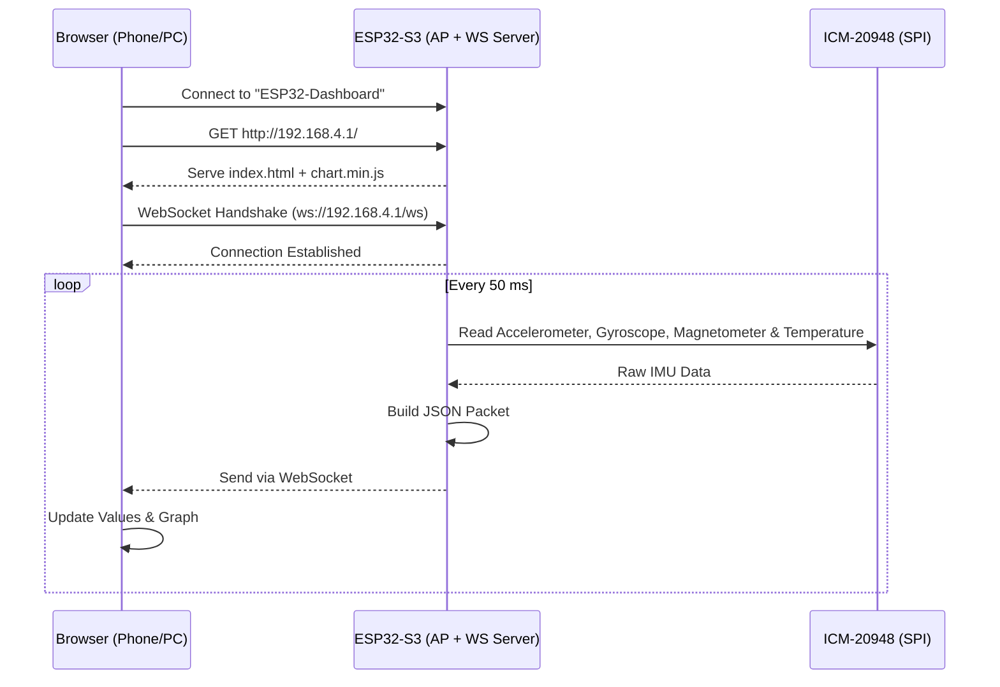

# 📊 ESP32-S3 + ICM-20948 Real-Time Wireless IMU Dashboard

[](https://platformio.org/)
[](https://www.arduino.cc/)
[](https://opensource.org/licenses/MIT)
[](http://makeapullrequest.com)

> **Live 9-DOF motion tracking directly in your browser — no internet, no router, zero configuration.**

Connect your phone or laptop to the ESP32's own Wi-Fi network, open **http://192.168.4.1**, and watch **accelerometer, gyroscope, magnetometer, and temperature** data stream at **20 Hz** — all served locally from the ESP32's flash memory.

---

# 📖 Table of Contents

- [✨ Features](#-features)
- [🧠 Architecture](#-architecture)
- [🔌 Hardware Wiring](#-hardware-wiring-spi-mode)
- [📁 Project Structure](#-project-structure)
- [🛠️ Prerequisites](#-prerequisites)
- [📥 Installation & Upload](#-installation--upload)
- [🛡️ Fallback Behavior](#️-fallback-behavior)
- [📸 Screenshots](#-screenshots--demo)
- [🐛 Troubleshooting](#-troubleshooting)
- [🤝 Contributing](#-contributing)
- [📄 License](#-license)

---

# ✨ Features

| Feature | Description |
|----------|-------------|
| 📶 **Self-Hosted Wi-Fi AP** | ESP32 creates its own network—no router, internet, or external dependencies required. |
| 🚀 **Real-Time Streaming** | WebSocket server pushes **9-axis IMU data + temperature** at **20 Hz (every 50 ms)**. |
| 📊 **Live Dashboard** | Dark-mode interface with live values and a scrolling **Chart.js** graph. |
| 🛡️ **Intelligent Fallback** | Automatically generates smooth sine waves when the sensor is unavailable so the dashboard never breaks. |
| 💾 **CSV Export** | Download logged sensor data for offline analysis in Excel or Python. |
| 🔌 **Offline-First** | All web assets are stored inside the ESP32 using **LittleFS**—no CDN required. |
| ⚡ **PlatformIO Project** | Professional C++ workflow with dependency management and one-click uploads. |

---

# 🧠 Architecture

The system follows a **client-server architecture**, where the ESP32 acts as both:

- Wi-Fi Access Point (AP)
- Web Server
- WebSocket Server

while the browser acts as the dashboard client.



---

# 🔌 Hardware Wiring (SPI Mode)

Connect the **ICM-20948** to the **ESP32-S3** using the **SPI interface** for maximum speed (up to **7 MHz**).

| ICM-20948 Pin | ESP32-S3 Pin | Suggested Wire Color |
|---------------|--------------|----------------------|
| VCC | 3.3V | 🔴 Red |
| GND | GND | ⚫ Black |
| SCK / SCL | GPIO 12 | 🟡 Yellow |
| MOSI / SDA | GPIO 11 | 🟢 Green |
| MISO / SDO | GPIO 13 | 🔵 Blue |
| CS | GPIO 10 | 🟠 Orange |

> ⚠️ **Important Notes**
>
> - The **ICM-20948 operates only at 3.3V**. Applying **5V** will permanently damage the sensor.
> - Ensure the **ADR jumper is OPEN** (not soldered). A closed jumper disables SPI mode.
> - Verify that **MOSI** connects to **MOSI** and **MISO** connects to **MISO**. These are commonly swapped accidentally.

---

# 📁 Project Structure

```text
ICM20949_WebServer/
├── .gitignore                  # PlatformIO, Python, and IDE ignores
├── platformio.ini              # PlatformIO configuration
├── README.md                   # Documentation
├── data/
│   ├── chart.min.js            # Local Chart.js library (~230 KB)
│   └── index.html              # Dashboard HTML/CSS/JavaScript
└── src/
    └── main.cpp                # ESP32 firmware
```

## 📂 data/

The **data/** directory stores all dashboard assets.

Running

```bash
pio run --target uploadfs
```

packages the entire folder into a **LittleFS filesystem image** and flashes it into the ESP32's flash memory, allowing the dashboard to work **completely offline**.

---

## 🛠️ Prerequisites

Before starting, install the following:

- VS Code
- PlatformIO IDE Extension
- Git *(optional)*
- USB data cable
- ESP32-S3 development board

For best results:

- Use the **Native USB** port for firmware uploading.
- Use the **UART (CP210x)** port for Serial Monitor.

---

# 📥 Installation & Upload

## 1. Clone the Repository

```bash
git clone https://github.com/shyler-web/ICM20949_WebServer.git
cd ICM20949_WebServer
```

---

## 2. Upload the LittleFS Filesystem

Upload the dashboard files stored inside the `data/` directory.

```bash
pio run --target uploadfs
```

Expected output:

```text
[SUCCESS] Took X.XX seconds
```

---

## 3. Upload the Firmware

Compile and flash the firmware.

```bash
pio run --target upload
```

Expected output:

```text
[SUCCESS] Took X.XX seconds
Hard resetting via RTS pin...
```

---

## 4. Open the Serial Monitor (Optional)

Linux / WSL2

```bash
pio device monitor --port /dev/ttyUSB0
```

Windows

```bash
pio device monitor --port COMx
```

Replace **COMx** with your actual COM port.

Press the **RST** button on the ESP32 to see boot messages and the Access Point IP address.

---

## 5. Open the Dashboard

1. Open Wi-Fi settings.
2. Connect to:

```
ESP32-Dashboard
```

Password:

```
12345678
```

Open:

```
http://192.168.4.1
```

The dashboard loads instantly and begins displaying live IMU data.

---

# 🛡️ Fallback Behavior

The firmware includes an automatic fallback mode.

| Scenario | Behavior |
|----------|----------|
| Sensor connected correctly | Streams real accelerometer, gyroscope, magnetometer, and temperature data. |
| Sensor missing or wiring incorrect | Automatically generates smooth sine-wave data while keeping the dashboard fully functional. |

> **Why this is useful**
>
> You can verify the Wi-Fi, web interface, WebSocket communication, and charts even before wiring the sensor. Once the sensor is connected correctly, real sensor values automatically replace the simulated data without modifying the code.

---

# 📸 Screenshots & Demo

> **Replace the placeholder images below with your own screenshots.**

| Live Dashboard | Hardware Setup |
|:--------------:|:--------------:|
|  |  |
| *Dashboard displaying live values* | *ESP32-S3 connected to ICM-20948 via SPI* |

### 🎬 Demo

Replace this placeholder with your demonstration video.

```text
https://www.youtube.com/watch?v=YOUR_VIDEO_ID
```

---

# 🐛 Troubleshooting

| Problem | Likely Cause | Solution |
|----------|-------------|----------|
| Sensor not detected | MOSI/MISO swapped or ADR jumper closed | Verify SPI wiring and keep ADR jumper OPEN |
| Dashboard loads but values remain zero | Cached HTML page | Hard refresh (`Ctrl + F5`) or clear browser cache |
| WebSocket fails (`Chart is not defined`) | chart.min.js missing | Re-run `pio run --target uploadfs` |
| LittleFS mount failed | Filesystem not flashed | Upload LittleFS again |
| `pio` command not found | PlatformIO not installed globally | Activate your virtual environment or install PlatformIO |
| USB port missing in WSL2 | USB device not attached | Attach it using `usbipd attach --wsl --busid <BUSID>` |

---

# 🤝 Contributing

Contributions are welcome.

Ideas include:

- 3D Orientation Cube
- Quaternion Visualization
- ADS1299 Integration
- Better Dashboard UI
- Mobile Optimizations

### Contribution Workflow

```bash
git checkout -b feature/amazing-feature
git commit -m "Add amazing feature"
git push origin feature/amazing-feature
```

Then open a Pull Request.

---

# 📄 License

This project is licensed under the **MIT License**.

See the **LICENSE** file for complete details.

---

## ⭐ Support the Project

If this project helped you, consider giving it a ⭐ on GitHub.

[](https://github.com/shyler-web/ICM20949_WebServer)
